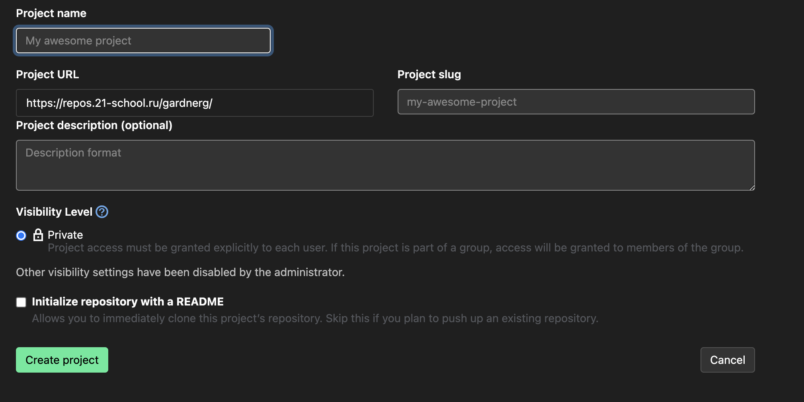
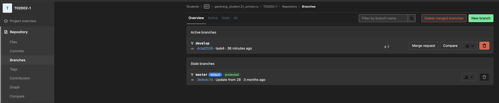
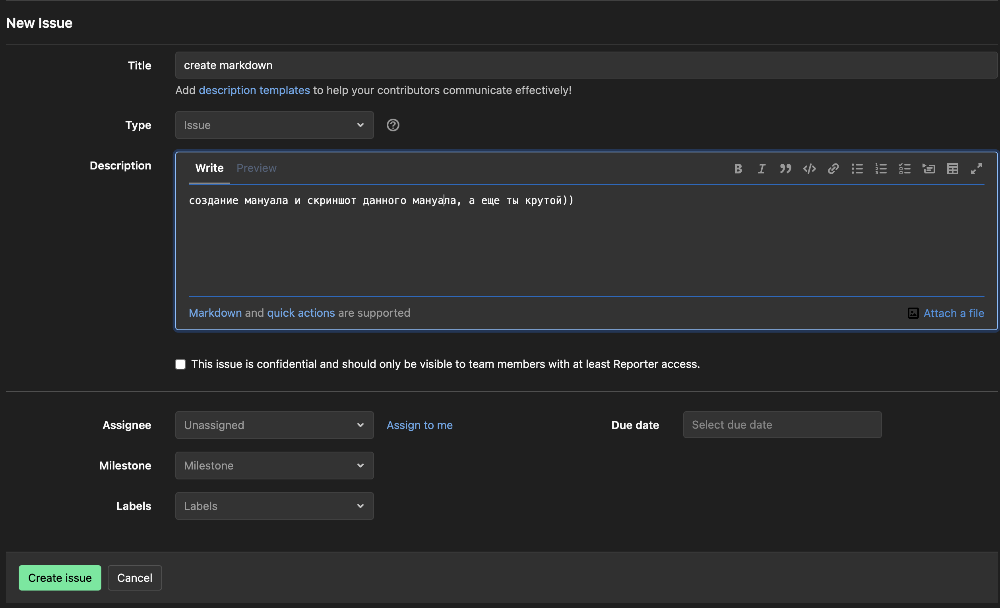
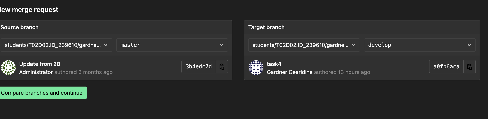
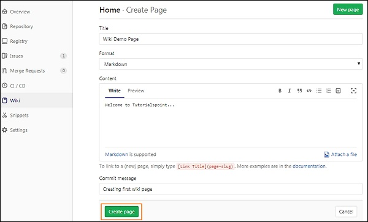

# **Руководство по использованию GitLab**

## Создание личного репозитория с нужным .gitignore и простым README.MD

1. Перейдите на страницу вашей группы в GitLab.
2. Щелкните на кнопку "Project Blank" (Новый проект).
3. Заполните необходимые поля, выберите настройки видимости проекта и нажмите "Create Project" (Создать проект).
4. В разделе "Advanced" (Дополнительно) выберите нужный вам .gitignore шаблон.
5. Введите описание проекта в файле README.md и сохраните его.

## Создание веток develop и master

1. Перейдите в репозиторий вашего проекта в GitLab.
2. Щелкните на вкладку "Repository" (Репозиторий).
3. В поле "Branch name" (Имя ветки) введите "master" и нажмите "Create branch" (Создать ветку).
4. Повторите шаги 2-3 для создания ветки "develop".

## Установка ветки develop по умолчанию

1. Перейдите в репозиторий вашего проекта в GitLab.
2. Щелкните на вкладку "Settings" (Настройки).
3. В разделе "Repository" (Репозиторий) выберите "General" (Общие).
4. В поле "Default branch" (Ветка по умолчанию) выберите "develop" и сохраните изменения.

## Создание issue на создание текущего мануала

1. Перейдите в репозиторий вашего проекта в GitLab.
2. Щелкните на вкладку "Issues" (Задачи).
3. Щелкните на кнопку "New Issue" (Новая задача).
4. Заполните необходимые поля, добавьте описание текущего мануала и сохраните задачу.

## Создание ветки по issue

1. На экране Issue вы видите зеленую кнопку с пометкой "Create a merge request", со стрелкой вниз вправо.
2. Нажмите на стрелочку вниз
3. Выберите "Create a branch"
4. Нажмите на "Create a branch"
5. Создается ветка из номера выдачи, плюс заголовок ветки
6. Например, мой issue #1, с названием "create markdown" будет ветка под названием:
7. 1-create-markdown
8. Заметьте, что она меняется case на all-lower-case

## Создание merge request по ветке в develop

1. Перейдите в репозиторий вашего проекта в GitLab.
2. Щелкните на вкладку "Merge Requests" (Запросы на слияние).
3. Щелкните на кнопку "New Merge Request" (Новый запрос на слияние).
4. В поле "Source branch" (Исходная ветка) выберите вашу созданную ветку, а в поле "Target branch" (Целевая ветка) выберите "develop".
5. Заполните необходимые поля и создайте merge request.

## Комментирование и принятие реквеста

1. Перейдите в репозиторий вашего проекта в GitLab.
2. Щелкните на вкладку "Merge Requests" (Запросы на слияние).
3. Выберите нужный merge request из списка.
4. Оставьте комментарии, проверьте изменения и, если все в порядке, нажмите "Merge" (Слить).

## Формирование стабильной версии в master с простановкой тега

1. Перейдите в репозиторий вашего проекта в GitLab.
2. Щелкните на вкладку "Repository" (Репозиторий).
3. В выпадающем меню "Branch" (Ветка) выберите ветку "master".
4. Нажмите на кнопку "New tag" (Новый тег).
5. Введите имя тега, выберите коммит и создайте тег.

## Работа с wiki проекта

1. Перейдите в репозиторий вашего проекта в GitLab.
2. Щелкните на вкладку "Wiki".
3. Создайте и редактируйте страницы вашей вики, добавляйте ссылки и изображения по необходимости.

Это краткое руководство поможет вам освоить основные функции GitLab и успешно работать с вашим проектом.
